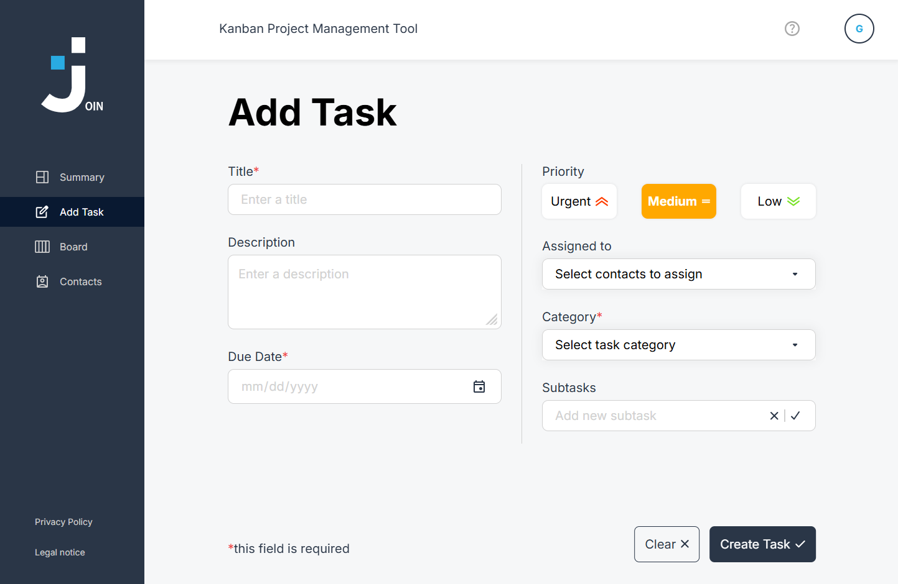
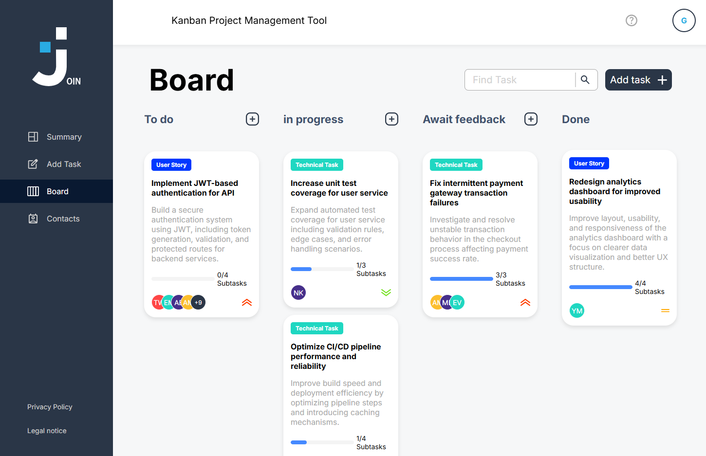

# Join - Kanban Task Management Application

## 📖 About the Project

**Join** is a Kanban-style web application for task and workflow management.  
It allows users to create tasks, manage contacts, assign responsibilities, and track progress through subtasks and visual status updates.

---

## 📸 Preview




---

## ✨ Key Features

### 📋 Kanban Board

- 4-column Kanban system (To Do, In Progress, Await Feedback, Done)
- Drag & drop task movement (desktop and mobile support)
- Visual task cards with priority and assignment overview

### 🧩 Task Management

- Create, edit, and delete tasks
- Add subtasks and track completion progress
- Assign contacts to tasks
- Detailed task view with full information

### 👥 Contact Management

- Create and manage contacts
- Assign contacts directly to tasks
- Centralized contact list for better organization

### 🔍 Productivity Features

- Search and filter tasks
- Clear visual workflow and status tracking
- Dashboard-style overview of task distribution

### 📱 Responsive Design

- Mobile-first design (320px+ support)
- Optimized for touch and desktop interactions
- Consistent UI across all devices

### 🔥 Technical Setup

- Firebase Authentication (login and session handling)
- Firestore database for real-time data storage
- Modular project structure with clean code principles

---

## 🛠️ Tech Stack

### Frontend

- Vanilla JavaScript (ES6+)
- HTML5
- CSS3

### Backend & Authentication

- Firebase Firestore (NoSQL database)
- Firebase Authentication

### Architecture

- Multi-Page Application (MPA)
- Modular code structure

### Development Tools

- Live Server (local development)
- Git & GitHub (version control)
- JSDoc (code documentation)

---

## 📁 Project Structure

```text
join/
├── assets/                # Images, icons, and fonts used across the app
├── html/                  # Main HTML pages for the app
├── scripts/               # JavaScript logic and interactions
│   ├── add-task/          # Task creation and subtask logic
│   ├── board/             # Kanban board logic, drag-and-drop, and task editing
│   ├── contacts/          # Contact management logic and validation
│   └── ...                # Additional script files and helpers
├── styles/                # CSS for layout, components, and responsiveness
│   ├── add-task/          # Styling for the add-task page
│   ├── board/             # Styling for the board page
│   ├── contacts/          # Styling for the contacts page
│   └── ...                # Additional styles and shared CSS files
├── index.html             # Main entry page of the app
├── script.js              # Global app setup and shared logic
├── robots.txt             # Search engine crawler instructions
└── README.md              # Project documentation
```

## 🚀 Installation & Setup

### 1. Clone the repository

```bash
git clone https://github.com/AnnikaEgger/join
cd join
```
